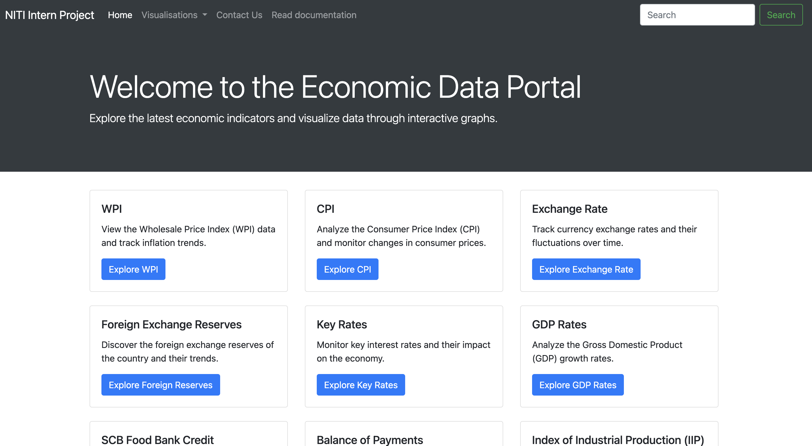
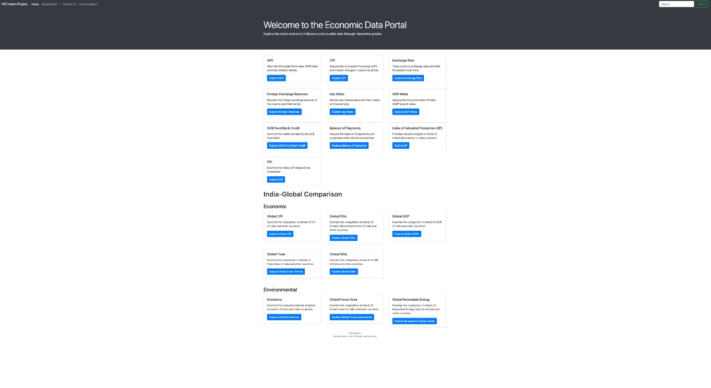
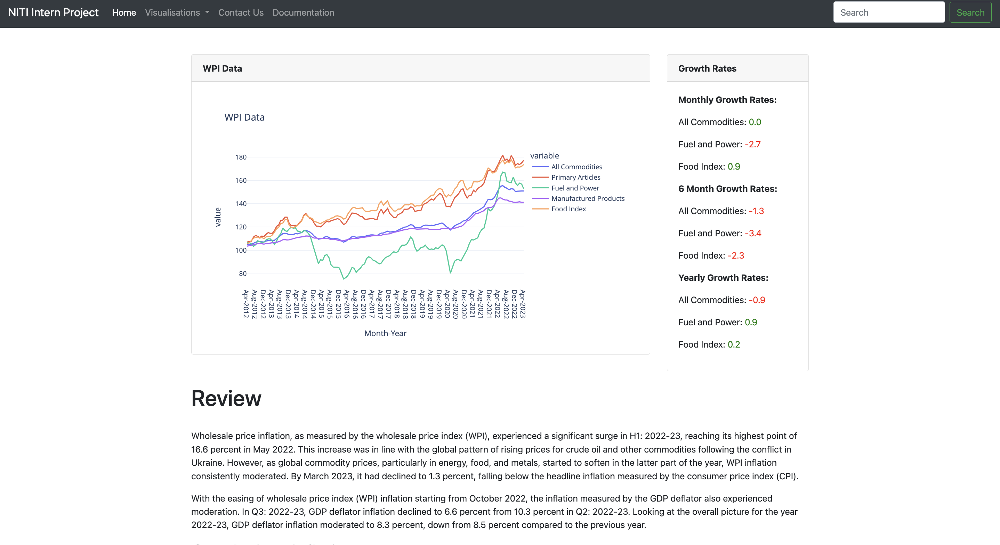
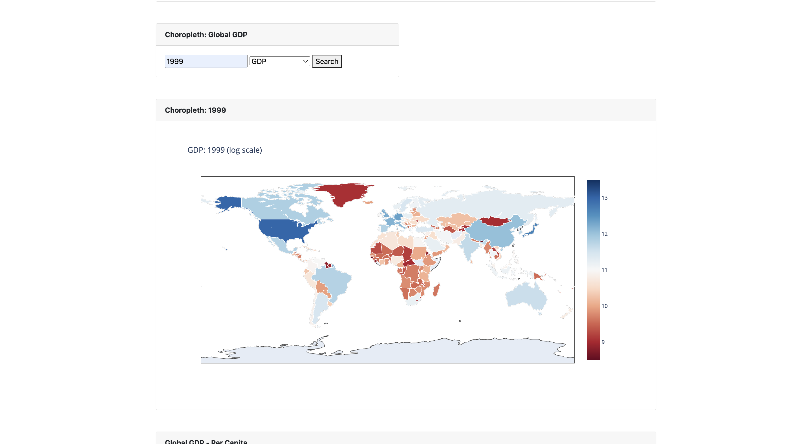
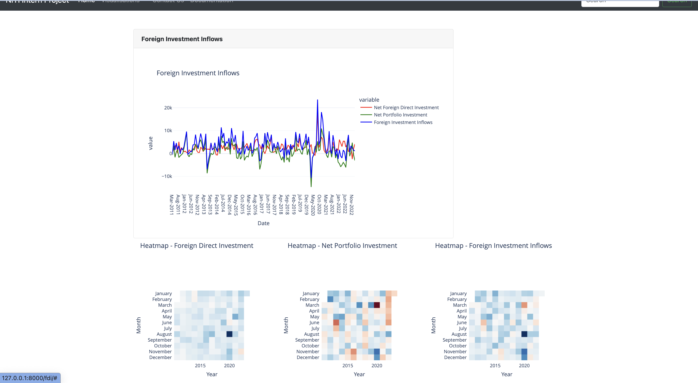
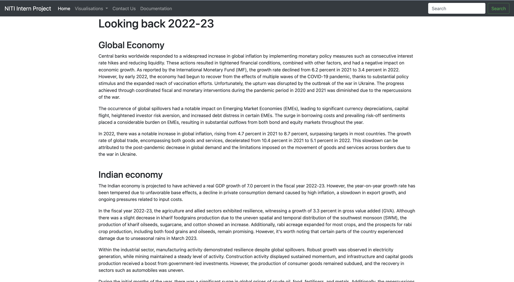

## NITI AAYOG INTERNSHIP PROJECT

- Worked closely with Dr. Amit Verma, Director, NITI Aayog in the Economics Vertical at __NITI Aayog, Govt. of India.__
- Conducted __extensive analysis of government data__ on various economic indicators sourced from reliable government sources like MOSPI and DBIE.
- Processed and visualized large datasets to identify valuable trends and patterns using tools like plotly and created a portal for easy access for the same using __Django__ .
- These insights contributed to informed decision-making and a __deeper understanding of the economic landscape in India__.

### Key Achievements
- Integrated and analyzed key indicators such as Balance of Payments, CPI, Exchange Rates, FDI, Forex Reserves, GDP, IIP, and GNI.

- Implemented visualizations including graphs, choropleths, and heatmaps to effectively present and analyze data.

- Developed and deployed an interactive website providing extensive analysis of economic indicators using Django, Python,  HTML, CSS, and JavaScript.

- Automated data updation and graphing processes using Python and Selenium to make scrapers.

